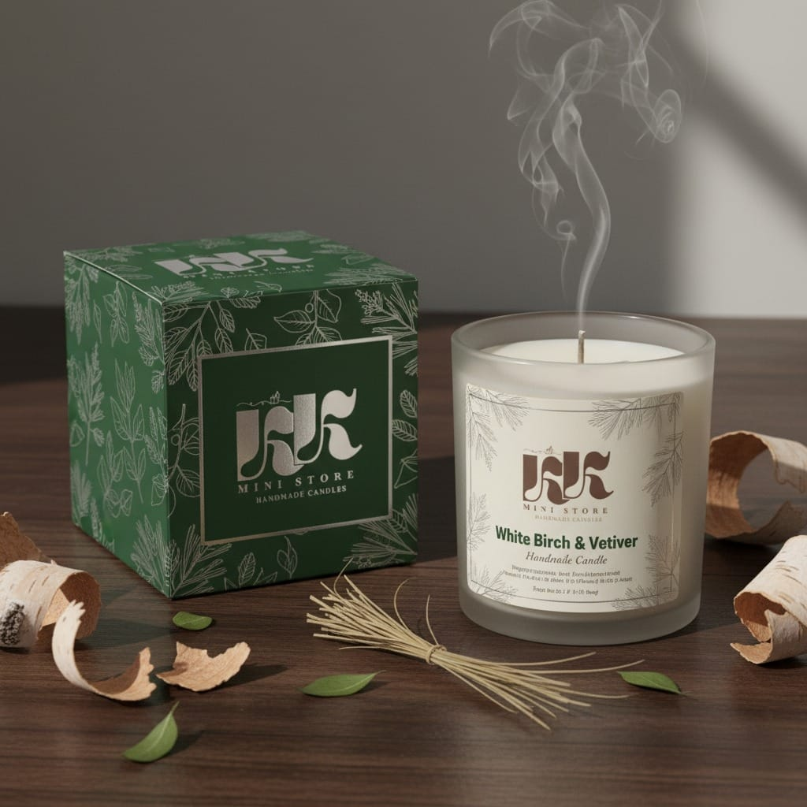
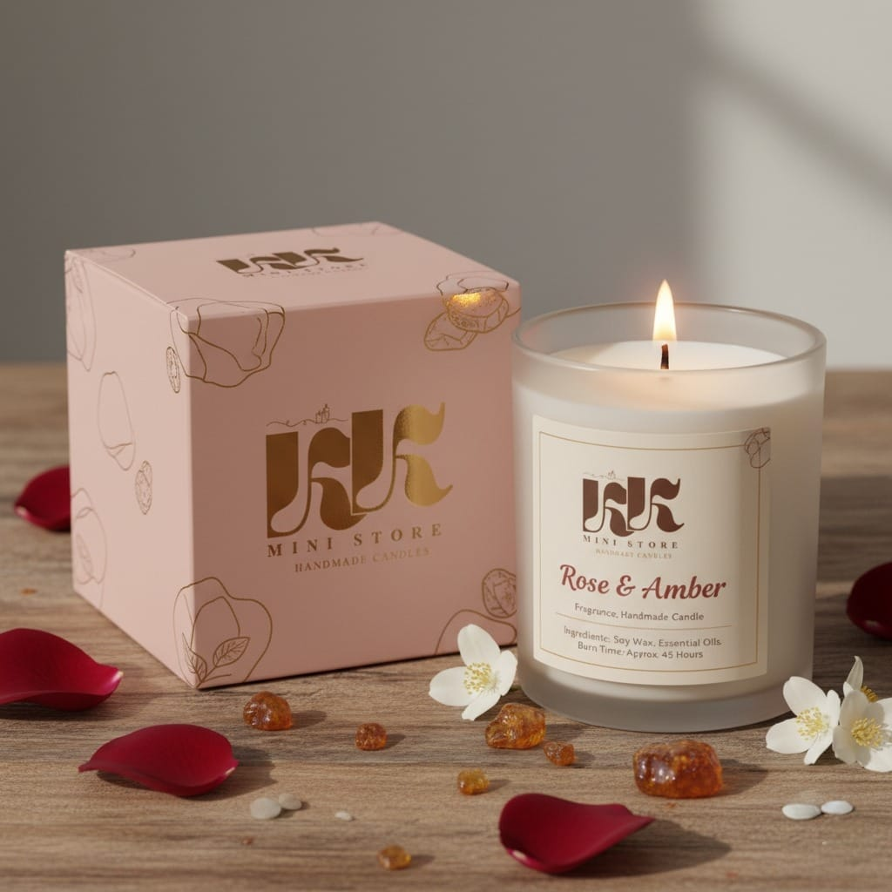
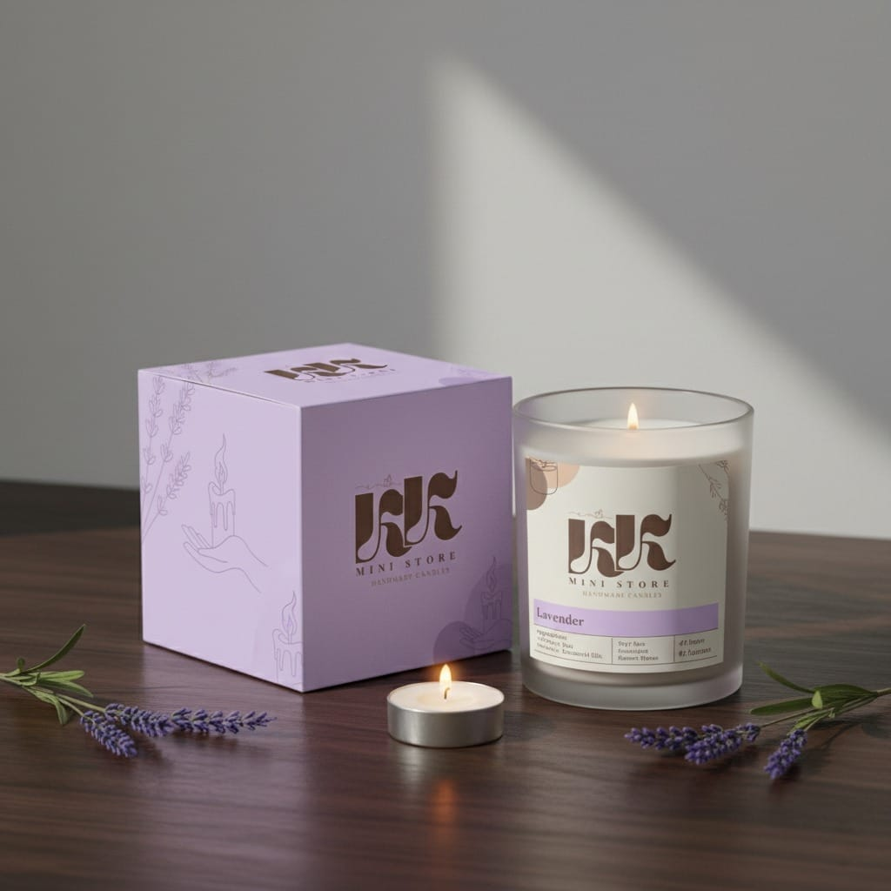

# LOGO-DESIGN-FOR---KK-Mini-Store-Handmade-Candles
🕯️ Mini Store – Handmade Candles Minimal and elegant branding design showcasing the logo, color palette, product mockups, and visual identity for Mini Store’s handmade candles.

🕯️ Mini Store – Handmade Candles

Welcome to the official branding and design repository for Mini Store, a handmade candle brand.
This repository showcases the logo design, brand identity, and product mockups that reflect the warm, cozy, and artisanal essence of our candles.

🌿 Brand Identity
Logo

Our logo combines:

Earthy tones to represent natural and sustainable ingredients

Minimalist shapes & line art to convey simplicity and elegance

Handcrafted essence that reflects our small-batch handmade candles

🎨 Color Palette
Color	Hex Code	Usage
Cream	#F5F3EE	Backgrounds
Beige	#D9C6B0	Accents
Brown	#5C4033	Logo / Typography
🕯️ Product Mockups

Brand visuals include mockups of:

Candle jars with custom labels

Candle tins in minimal packaging

Product boxes with natural tones

(Add images/screenshots here)

📸 Branding Preview

🚀 About Mini Store

Mini Store – Handmade Candles creates cozy, natural candles with love.
Our mission is to bring warmth, calm, and elegance into your space.

🔗 Follow Us

Instagram: uxui.payal
